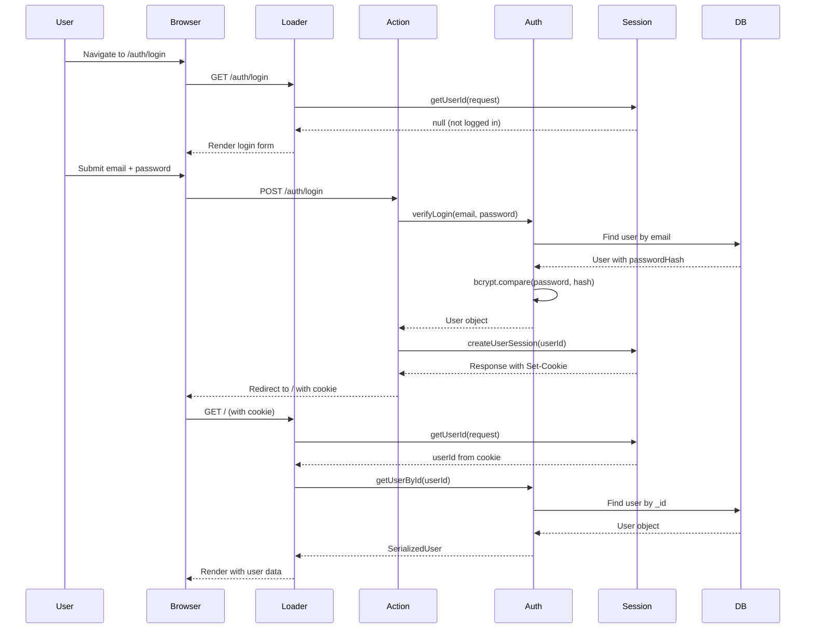

# Phase 4: Authentication Foundation - Deep Dive

**Completed:** January 7, 2026  
**Goal:** Understand how authentication and session management work in React Router

---

## Table of Contents

1. [Overview](#overview)
2. [Architecture](#architecture)
3. [User Type System](#user-type-system)
4. [Session Management](#session-management)
5. [Password Security](#password-security)
6. [Authentication Helpers](#authentication-helpers)
7. [Auth Routes](#auth-routes)
8. [Security Best Practices](#security-best-practices)
9. [Key Takeaways](#key-takeaways)

---

## Overview

Phase 4 adds **authentication and session management** to the wellness tracker application. This enables:
- User registration and login
- Secure password storage
- Session-based authentication
- Role-based access control (user vs admin)

### What Was Built

| Component | File | Purpose |
|-----------|------|---------|
| User Types | `app/types/user.ts` | Type definitions for users |
| Session Management | `app/lib/session.server.ts` | Cookie-based session storage |
| Auth Helpers | `app/lib/auth.server.ts` | Password hashing, user CRUD, route protection |
| Login Route | `app/routes/auth.login.tsx` | Login form and authentication |
| Register Route | `app/routes/auth.register.tsx` | User registration |
| Logout Route | `app/routes/auth.logout.tsx` | Session destruction |

---

## Architecture

### Authentication Flow Diagram



### Server-Only Execution

**Critical concept:** All authentication code runs **server-side only**.

```typescript
// ✅ CORRECT: .server.ts suffix = server-only
// app/lib/auth.server.ts
export async function hashPassword(password: string) {
  return bcrypt.hash(password, 10);
}

// ❌ WRONG: Without .server.ts, code could run on client
// app/lib/auth.ts  ← NO .server.ts suffix!
export async function hashPassword(password: string) {
  // This would bundle bcrypt into client JS (huge bundle size)
  // This would expose password hashing logic to client
}
```

**Why `.server.ts` matters:**
- React Router **strips** `.server.ts` files from client bundle
- Prevents sensitive code from reaching the browser
- Reduces bundle size (bcrypt is ~1MB)
- Protects secrets (SESSION_SECRET, password hashing logic)

---

## User Type System

### File: `app/types/user.ts`

#### 1. Database User Type

```typescript
export interface User {
    _id?: ObjectId;
    email: string;
    passwordHash: string;  // ← NEVER send to client!
    role: 'user' | 'admin';
    createdAt: Date;
    updatedAt: Date;
}
```

**Key points:**
- `_id` is optional (not present before insert)
- `passwordHash` stores bcrypt hash (not plain password)
- `role` enables authorization (user vs admin)
- Dates are `Date` objects (MongoDB native)

#### 2. Serialized User Type

```typescript
export interface SerializedUser {
    _id: string;           // ObjectId → string
    email: string;
    role: 'user' | 'admin';
    createdAt: string;     // Date → ISO string
    updatedAt: string;
    // passwordHash is EXCLUDED
}
```

**Why serialize?**
- JSON can't transport `ObjectId` or `Date` objects
- Must convert to strings for client
- **Security:** Removes `passwordHash` before sending to client

#### 3. Serialization Helper

```typescript
export function serializeUser(user: User): SerializedUser {
    return {
        _id: user._id?.toString() || '',
        email: user.email,
        role: user.role,
        createdAt: user.createdAt.toISOString(),
        updatedAt: user.updatedAt.toISOString(),
        // passwordHash intentionally excluded
    };
}
```

**When to use:**
- In loaders before returning user data
- In actions before returning user data
- Anywhere you send user data to client

---

## Session Management

### File: `app/lib/session.server.ts`

#### 1. Cookie Configuration

```typescript
const { getSession, commitSession, destroySession } = createCookieSessionStorage({
    cookie: {
        name: '__session',
        httpOnly: true,  // ← JavaScript can't access (XSS protection)
        maxAge: 60 * 60 * 24 * 7,  // 7 days
        path: '/',
        sameSite: 'lax',  // ← CSRF protection
        secrets: [sessionSecret],  // ← Encrypts cookie data
        secure: process.env.NODE_ENV === 'production',  // HTTPS only in prod
    },
});
```

**Security flags explained:**

| Flag | Purpose | Protection Against |
|------|---------|---------------------|
| `httpOnly: true` | Cookie not accessible via JavaScript | XSS (Cross-Site Scripting) |
| `sameSite: 'lax'` | Cookie not sent on cross-site requests | CSRF (Cross-Site Request Forgery) |
| `secure: true` | Cookie only sent over HTTPS | Man-in-the-middle attacks |
| `secrets: [...]` | Encrypts and signs cookie data | Cookie tampering |

#### 2. Get User ID from Session

```typescript
export async function getUserId(request: Request): Promise<string | null> {
    const session = await getSession(request.headers.get('Cookie'));
    const userId = session.get('userId');
    return userId || null;
}
```

**Flow:**
1. Extract `Cookie` header from request
2. Decrypt and verify session cookie
3. Get `userId` from session data
4. Return `userId` or `null` if not logged in

**When to use:**
- Check if user is logged in
- Get current user ID without fetching from DB

#### 3. Create User Session

```typescript
export async function createUserSession(
    userId: string,
    redirectTo: string
): Promise<Response> {
    const session = await getSession();
    session.set('userId', userId);  // ← Store only ID, not full user

    return redirect(redirectTo, {
        headers: {
            'Set-Cookie': await commitSession(session),  // ← Encrypt and sign
        },
    });
}
```

**Why store only user ID?**
- ✅ Keeps cookie small (< 4KB limit)
- ✅ User data stays fresh (fetch from DB each request)
- ✅ Reduces security risk (less data in cookie)
- ❌ Don't store full user object (stale data, large size)

**Flow:**
1. Create new session
2. Set `userId` in session
3. Commit session (encrypts data)
4. Return redirect with `Set-Cookie` header
5. Browser stores cookie
6. Cookie sent automatically on future requests

#### 4. Logout (Destroy Session)

```typescript
export async function logout(request: Request, redirectTo: string = '/'): Promise<Response> {
    const session = await getSession(request.headers.get('Cookie'));

    return redirect(redirectTo, {
        headers: {
            'Set-Cookie': await destroySession(session),  // ← Clears cookie
        },
    });
}
```

**What happens:**
1. Get current session from cookie
2. Destroy session (clears data)
3. Return redirect with `Set-Cookie` header that expires cookie
4. Browser deletes cookie

---

## Password Security

### File: `app/lib/auth.server.ts`

#### 1. Password Hashing

```typescript
const SALT_ROUNDS = 10;

export async function hashPassword(password: string): Promise<string> {
    return bcrypt.hash(password, SALT_ROUNDS);
}
```

**What is bcrypt?**
- Industry-standard password hashing algorithm
- **Slow by design** (prevents brute-force attacks)
- Automatically generates salt (random data)
- Output format: `$2b$10$<salt><hash>` (60 characters)

**Salt rounds:**
- `10` = 2^10 = 1,024 iterations
- Higher = slower (more secure, but slower login)
- `10` is good balance for 2026

**Example:**
```typescript
const hash = await hashPassword('myPassword123');
// Result: "$2b$10$N9qo8uLOickgx2ZMRZoMye.IjefO9Z5.UvIZsr7Mw3Oc1p7TKi2yG"
```

#### 2. Password Verification

```typescript
export async function verifyPassword(password: string, hash: string): Promise<boolean> {
    return bcrypt.compare(password, hash);
}
```

**How it works:**
1. Extract salt from stored hash
2. Hash provided password with same salt
3. Compare hashes (constant-time comparison)
4. Return `true` if match, `false` otherwise

**Timing-safe comparison:**
- bcrypt uses constant-time comparison
- Prevents timing attacks (can't guess password by measuring response time)

#### 3. Never Store Plain Passwords

```typescript
// ❌ NEVER DO THIS
const user = {
    email: 'user@example.com',
    password: 'myPassword123',  // ← WRONG! Plain text!
};

// ✅ ALWAYS DO THIS
const user = {
    email: 'user@example.com',
    passwordHash: await hashPassword('myPassword123'),  // ← Hashed!
};
```

**Why?**
- Database breaches happen
- Admins shouldn't see passwords
- Users reuse passwords across sites
- Legal/compliance requirements (GDPR, etc.)

---

## Authentication Helpers

### File: `app/lib/auth.server.ts`

#### 1. Get User by Email

```typescript
export async function getUserByEmail(email: string): Promise<User | null> {
    const users = await getCollection<User>('users');
    return users.findOne({ email: email.toLowerCase() });
}
```

**Key points:**
- Normalizes email to lowercase (case-insensitive login)
- Returns `null` if not found (not an error)
- Used in login and registration

#### 2. Get User by ID

```typescript
export async function getUserById(userId: string): Promise<User | null> {
    const users = await getCollection<User>('users');
    return users.findOne({ _id: new ObjectId(userId) });
}
```

**Key points:**
- Converts string ID to `ObjectId`
- Used in loaders to get current user
- Returns `null` if not found (session may be stale)

#### 3. Create User

```typescript
export async function createUser(
    email: string,
    password: string,
    role: 'user' | 'admin' = 'user'
): Promise<User> {
    const users = await getCollection<User>('users');

    // Check if user already exists
    const existingUser = await getUserByEmail(email);
    if (existingUser) {
        throw new Error('User with this email already exists');
    }

    // Hash password
    const passwordHash = await hashPassword(password);

    // Create user
    const user: Omit<User, '_id'> = {
        email: email.toLowerCase(),
        passwordHash,
        role,
        createdAt: new Date(),
        updatedAt: new Date(),
    };

    const result = await users.insertOne(user as User);

    return {
        ...user,
        _id: result.insertedId,
    } as User;
}
```

**Flow:**
1. Check if email already exists → throw error if duplicate
2. Hash password with bcrypt
3. Create user object (lowercase email, timestamps)
4. Insert into MongoDB
5. Return user with `_id` from insert result

**Error handling:**
- Throws error if email exists (caught in action)
- Caller handles error display to user

#### 4. Verify Login

```typescript
export async function verifyLogin(email: string, password: string): Promise<User | null> {
    const user = await getUserByEmail(email);

    if (!user) {
        return null;  // User not found
    }

    const isValid = await verifyPassword(password, user.passwordHash);

    return isValid ? user : null;  // Return user if valid, null if invalid
}
```

**Security note:**
- Returns `null` for both "user not found" and "wrong password"
- Prevents username enumeration attacks
- Attacker can't tell if email exists

#### 5. Get Optional User

```typescript
export async function getOptionalUser(request: Request): Promise<SerializedUser | null> {
    const userId = await getUserId(request);

    if (!userId) {
        return null;  // Not logged in
    }

    const user = await getUserById(userId);

    if (!user) {
        return null;  // User deleted or session stale
    }

    return serializeUser(user);  // ← Removes passwordHash
}
```

**When to use:**
- Public routes that show different UI for logged-in users
- Example: Homepage shows "Login" or "Dashboard" button

#### 6. Require User (Protected Routes)

```typescript
export async function requireUser(
    request: Request,
    redirectTo?: string
): Promise<SerializedUser> {
    const userId = await getUserId(request);

    if (!userId) {
        const url = new URL(request.url);
        const searchParams = new URLSearchParams([
            ['redirectTo', redirectTo || url.pathname],
        ]);
        throw redirect(`/auth/login?${searchParams}`);  // ← Redirect to login
    }

    const user = await getUserById(userId);

    if (!user) {
        throw redirect('/auth/login');
    }

    return serializeUser(user);
}
```

**Flow:**
1. Get user ID from session
2. If no user ID → redirect to login with `?redirectTo=<current-page>`
3. Fetch user from database
4. If user not found → redirect to login (stale session)
5. Return serialized user

**Usage in loaders:**
```typescript
export async function loader({ request }: Route.LoaderArgs) {
    const user = await requireUser(request);
    // If we reach here, user is guaranteed to be logged in
    // ...
}
```

#### 7. Require Admin (Role-Based Protection)

```typescript
export async function requireAdmin(request: Request): Promise<SerializedUser> {
    const user = await requireUser(request);  // ← First check if logged in

    if (user.role !== 'admin') {
        throw new Response('Forbidden: Admin access required', { status: 403 });
    }

    return user;
}
```

**Flow:**
1. Call `requireUser` (redirects to login if not authenticated)
2. Check if user role is `'admin'`
3. If not admin → throw 403 Forbidden response
4. Return user (guaranteed to be admin)

**Usage in admin loaders:**
```typescript
export async function loader({ request }: Route.LoaderArgs) {
    const user = await requireAdmin(request);
    // User is guaranteed to be logged in AND admin
    // ...
}
```

---

## Auth Routes

### 1. Login Route (`auth.login.tsx`)

#### Loader: Redirect if Already Logged In

```typescript
export async function loader({ request }: Route.LoaderArgs) {
    // If already logged in, redirect to home
    const userId = await getUserId(request);
    if (userId) {
        return redirect('/');
    }

    // Get redirectTo from URL params (where to go after login)
    const url = new URL(request.url);
    const redirectTo = url.searchParams.get('redirectTo') || '/';

    return { redirectTo };
}
```

**Why check if logged in?**
- Prevents logged-in users from seeing login form
- Better UX (no confusion)

**`redirectTo` parameter:**
- Example: User tries to access `/progress` (protected)
- Gets redirected to `/auth/login?redirectTo=/progress`
- After login, redirects back to `/progress`

#### Action: Verify Credentials and Create Session

```typescript
export async function action({ request }: Route.ActionArgs) {
    const formData = await request.formData();
    const email = String(formData.get('email'));
    const password = String(formData.get('password'));
    const redirectTo = String(formData.get('redirectTo') || '/');

    // Validate input
    const errors: { email?: string; password?: string; form?: string } = {};

    if (!email || !email.includes('@')) {
        errors.email = 'Valid email is required';
    }

    if (!password || password.length < 6) {
        errors.password = 'Password must be at least 6 characters';
    }

    if (Object.keys(errors).length > 0) {
        return { errors };  // ← Return errors to component
    }

    // Verify credentials
    const user = await verifyLogin(email, password);

    if (!user) {
        return {
            errors: {
                form: 'Invalid email or password',  // ← Generic error (security)
            },
        };
    }

    // Create session and redirect
    return createUserSession(user._id!.toString(), redirectTo);
}
```

**Validation strategy:**
- Client-side: HTML5 validation (`required`, `type="email"`)
- Server-side: Always validate (client can be bypassed)
- Field-level errors: Show under each input
- Form-level errors: Show at top (login failure)

**Security:**
- Generic error message ("Invalid email or password")
- Doesn't reveal if email exists
- Prevents username enumeration

#### Component: Login Form

```typescript
export default function Login({ loaderData, actionData }: Route.ComponentProps) {
    return (
        <Form method="post">
            <input type="hidden" name="redirectTo" value={loaderData.redirectTo} />
            
            {actionData?.errors?.form && (
                <div className="error">{actionData.errors.form}</div>
            )}
            
            <input name="email" type="email" required />
            {actionData?.errors?.email && <p>{actionData.errors.email}</p>}
            
            <input name="password" type="password" required />
            {actionData?.errors?.password && <p>{actionData.errors.password}</p>}
            
            <button type="submit">Log In</button>
        </Form>
    );
}
```

**Key points:**
- Hidden input preserves `redirectTo` across form submission
- `actionData` contains errors from action
- Progressive enhancement: Works without JavaScript

---

### 2. Register Route (`auth.register.tsx`)

#### Loader: Redirect if Already Logged In

```typescript
export async function loader({ request }: Route.LoaderArgs) {
    const userId = await getUserId(request);
    if (userId) {
        return redirect('/');
    }
    return {};
}
```

#### Action: Create User and Session

```typescript
export async function action({ request }: Route.ActionArgs) {
    const formData = await request.formData();
    const email = String(formData.get('email'));
    const password = String(formData.get('password'));
    const confirmPassword = String(formData.get('confirmPassword'));

    // Validate input
    const errors: {
        email?: string;
        password?: string;
        confirmPassword?: string;
        form?: string;
    } = {};

    if (!email || !email.includes('@')) {
        errors.email = 'Valid email is required';
    }

    if (!password || password.length < 6) {
        errors.password = 'Password must be at least 6 characters';
    }

    if (password !== confirmPassword) {
        errors.confirmPassword = 'Passwords do not match';
    }

    if (Object.keys(errors).length > 0) {
        return { errors };
    }

    // Create user
    try {
        const user = await createUser(email, password, 'user');

        // Create session and redirect
        return createUserSession(user._id!.toString(), '/');
    } catch (error) {
        return {
            errors: {
                form: error instanceof Error ? error.message : 'Failed to create account',
            },
        };
    }
}
```

**Validation differences from login:**
- Additional `confirmPassword` field
- Password match validation
- Error handling for duplicate email (from `createUser`)

**Flow:**
1. Validate all fields
2. Try to create user (may throw if email exists)
3. If successful → create session and redirect to home
4. If error → show error message

---

### 3. Logout Route (`auth.logout.tsx`)

#### Action-Only Route

```typescript
export async function action({ request }: Route.ActionArgs) {
    return logout(request, '/');
}

export async function loader({ request }: Route.LoaderArgs) {
    // If someone navigates to /auth/logout directly, log them out
    return logout(request, '/');
}
```

**Why both action and loader?**
- **Action:** For `<Form method="post" action="/auth/logout">`
- **Loader:** For direct navigation (typing URL in browser)

**Usage in components:**
```typescript
<Form method="post" action="/auth/logout">
    <button type="submit">Log Out</button>
</Form>
```

**No component needed:**
- Route only destroys session and redirects
- Never renders UI

---

## Security Best Practices

### 1. Password Security

| ✅ Do | ❌ Don't |
|-------|----------|
| Hash passwords with bcrypt | Store plain-text passwords |
| Use salt rounds ≥ 10 | Use MD5 or SHA-1 for passwords |
| Validate password length (≥ 6 chars) | Allow weak passwords |
| Use constant-time comparison | Use `===` to compare passwords |

### 2. Session Security

| ✅ Do | ❌ Don't |
|-------|----------|
| Use `httpOnly` cookies | Store tokens in localStorage |
| Set `sameSite: 'lax'` or `'strict'` | Allow cross-site cookie sending |
| Use `secure: true` in production | Send cookies over HTTP in prod |
| Store only user ID in session | Store full user object in session |
| Encrypt session data | Store plain-text session data |

### 3. Input Validation

| ✅ Do | ❌ Don't |
|-------|----------|
| Validate on both client and server | Trust client-side validation only |
| Normalize email (lowercase) | Allow case-sensitive emails |
| Show generic errors for login failures | Reveal if email exists |
| Sanitize all user input | Trust user input |

### 4. Error Handling

| ✅ Do | ❌ Don't |
|-------|----------|
| Return generic "Invalid credentials" | Say "Email not found" vs "Wrong password" |
| Log errors server-side | Expose stack traces to client |
| Handle duplicate email gracefully | Crash on duplicate key error |

---

## Key Takeaways

### 1. Server-Only Execution

**All authentication code runs server-side:**
- `.server.ts` suffix prevents client bundling
- Protects secrets (SESSION_SECRET, password hashes)
- Reduces bundle size (bcrypt is large)

### 2. Cookie-Based Sessions

**Why cookies over tokens:**
- Automatic with every request (no manual headers)
- Secure flags (`httpOnly`, `sameSite`, `secure`)
- Works with progressive enhancement (no JS needed)
- Built-in CSRF protection with `sameSite`

### 3. Password Hashing

**Never store plain passwords:**
- Use bcrypt (industry standard)
- Slow by design (prevents brute-force)
- Automatic salt generation
- Constant-time comparison

### 4. Type Safety

**Two user types:**
- `User` (database) - includes `passwordHash`
- `SerializedUser` (client) - excludes `passwordHash`
- Always serialize before sending to client

### 5. Route Protection Patterns

**Three levels of access:**
1. **Public routes:** Use `getOptionalUser` (returns `null` if not logged in)
2. **User routes:** Use `requireUser` (redirects to login)
3. **Admin routes:** Use `requireAdmin` (redirects to login, throws 403 if not admin)

### 6. Progressive Enhancement

**Forms work without JavaScript:**
- Native `<form>` with `method="post"`
- Server-side validation
- Redirect after success
- React Router enhances with client-side navigation

### 7. Security by Default

**Built-in protections:**
- XSS: `httpOnly` cookies
- CSRF: `sameSite` cookies
- Timing attacks: bcrypt constant-time comparison
- Username enumeration: Generic error messages
- Session tampering: Encrypted and signed cookies

---

## Next Steps

**Phase 5: Route Protection & Authorization**
- Add `requireUser` to user routes (`quizzes.$id`, `progress`, `results.$id`)
- Add `requireAdmin` to admin routes (`admin.*`)
- Update actions to verify ownership (users can't edit others' data)
- Test protection (try accessing routes without login)

**Questions to explore:**
1. How do you protect a route that requires authentication?
2. How do you verify a user owns a resource before showing it?
3. What happens if a user's session expires?
4. How do you handle "remember me" functionality?
5. How would you implement password reset?

---

## Summary

Phase 4 established the **authentication foundation** for the wellness tracker:

✅ **User type system** with secure serialization  
✅ **Cookie-based sessions** with encryption and security flags  
✅ **Password hashing** with bcrypt  
✅ **Authentication helpers** for user CRUD and route protection  
✅ **Login/register/logout routes** with validation and error handling  
✅ **Security best practices** built-in from the start  

**Core principle:** Authentication is a **server-side concern**. Never trust the client, always validate on the server, and protect sensitive data (passwords, sessions) with industry-standard tools (bcrypt, encrypted cookies).
